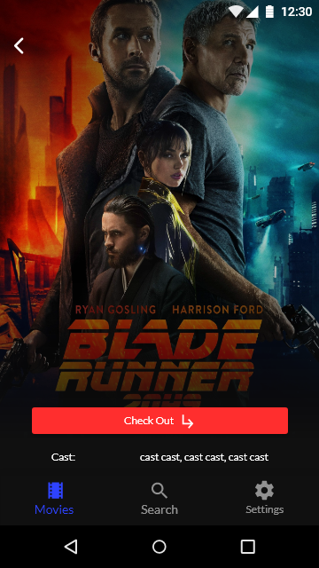

# Movie Hero

An app that provides a way to manage all DVD/VHS/BluRay movies. Sole purpose is to help those that dont use, got tired, or cant find a movie using digital streaming services. The app helps register movies that they already own such as DVD, VHS, Bluray, etc. Plus, comes packed with feaures that allow users to find the movie they've been looking for, or something different. 

## Features

- Stores movies in database with complete info including cast, genre, title, year, poster url, etc. 
- Search engine that finds a movie based on a single specification such as members of cast or title.
- Demonstrates a list of recently "checked out" movies.
- Shows movies by genre in the movies screen.
- Clean/modern UI

## Prototype

Home Screen

Movie Info Screen

Movie Info Screen 2

Movie Search Engine Screen

Adding Movie Screen

